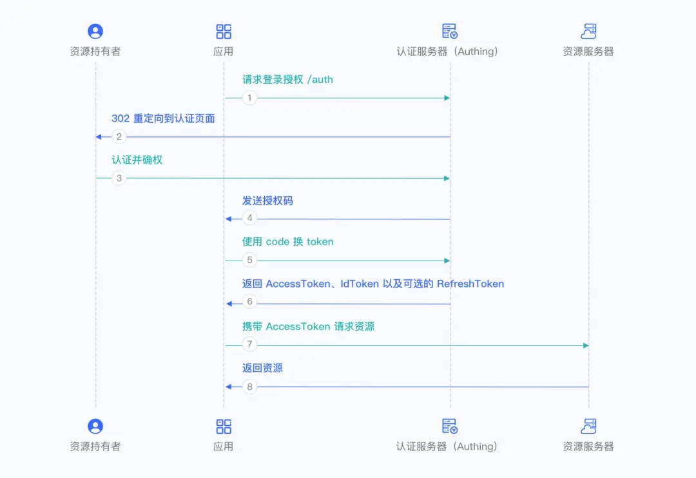
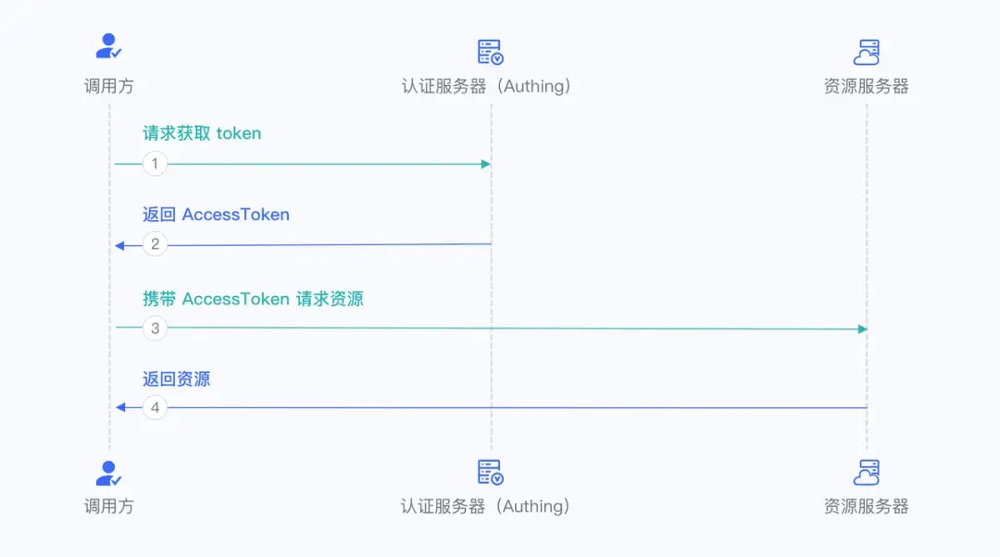

`sign up`:注册
`sign in`:登录
`Authentication`:认证
`Authorization：`授权
## OAuth 2.0 和 OIDC (OpenID Connect)的关系

## 1. OAuth 2.0
* **定位**：是一个Authorization框架
* **目标**：让用户把“资源访问权”授权给第三方应用，而不是把自己的账号密码给对方。
* **核心思想**：

  * 用户不直接把密码交给第三方。
  * 第三方通过 **Access Token**（访问令牌）去访问资源服务器。
* **典型场景**：

  * 用 Facebook 账号授权某个应用读取你的好友列表。
  * 用 Google 账号授权第三方应用访问你的 Google Drive 文件。

## 2. OpenID Connect (OIDC)

* **定位**：基于 OAuth 2.0 的 **身份认证（Authentication）协议**
* **目标**：在 OAuth 2.0 授权的基础上，增加“用户身份认证”能力。
* **新增内容**：

  * 定义了一个 **ID Token**（JWT 格式），里面包含了用户的身份信息（如 user id, email, name 等）。
  * 标准化了用户信息获取的方式（UserInfo Endpoint）。
* **典型场景**：

  * 使用 “Login with Google / Apple / Microsoft” 登录某个应用时，应用能拿到用户的身份信息（不是只有授权用的 access token）。

---

## 3. 关系

* **OAuth 2.0**：只管“授权” → 第三方能不能访问资源
* **OIDC**：在 OAuth 2.0 上扩展，额外处理“认证” → 确认用户是谁

👉 可以理解为：

* OAuth 2.0 = “你能不能访问”
* OIDC = “你是谁 + 你能不能访问”

---

## 4. 举例对比

* **OAuth 2.0**：

  * 你登录一个日历应用，它请求访问你的 Google Calendar。
  * Google 返回一个 **access token**，日历应用用它去读取/写入日历。
  * 这里应用知道它“被授权”访问，但不一定知道“你是谁”。

* **OIDC**：

  * 你用 “Login with Google” 登录某网站。
  * 网站通过 OIDC 拿到一个 **ID token**，里面写了用户的唯一 ID、邮箱、名字。
  * 这样网站就知道登录的是谁。

---

## 5. 总结表格

| 项目          | OAuth 2.0         | OIDC                                    |
| ----------- | ----------------- | --------------------------------------- |
| 关注点         | 授权（Authorization） | 认证 + 授权（Authentication + Authorization） |
| 返回的主要 Token | Access Token      | Access Token + ID Token                 |
| 能不能知道用户身份   | ❌ 不保证             | ✅ 可以（通过 ID Token / UserInfo）            |
| 场景          | 授权第三方访问资源         | 第三方应用“社交登录”/单点登录（SSO）                   |

---
| OIDC             | OAuth                         | 说明                                                                 |
|------------------|-------------------------------|----------------------------------------------------------------------|
| EU End User      | RS Resource Owner             | 指用户                                                              |
| RP Relying Party | Client Third-party application| 客户端，可以理解为你的前端                                          |
| OP OpenID Provider | AS Authorization Server      | 认证服务（Authing）                                                 |
| Resource Server  | RS Resource Server            | 资源服务器，可以理解为你的后台                                      |
| Endpoint         | Endpoint                      | 端点，即提供的 API 接口                                             |
| ID Token         | 无                            | 身份令牌（JWT），用于标识用户身份已经认证，可用于获取到用户身份信息 |
| Access Token     | Access Token                  | 访问令牌（JWT），适用于 API 的访问鉴权，通常前端携带 AccessToken 访问后台 |
| User Agent       | User Agent                    | 应用运行端，如浏览器、手机端                                        |

OAuth defines two types of clients: confidential clients and public clients.

Confidential clients are applications that are able to securely authenticate with the authorization server, for example being able to keep their registered client secret safe.

Public clients are unable to use registered client secrets, such as applications running in a browser or on a mobile device.

Confidential Clients 机密型应用：能够安全的存储凭证（client_secret），例如有后端服务，你的前端是 Vue，后台是 Java ，那么可以理解为机密性应用，因为你的后端能够安全的保存 client_secret，而不会将 client_secret 直接暴露给用户，此时你可以使用授权码模式。
比如后端服务调用第三方。

Public Clients 公共型应用：无法安全存储凭证（Client Secrets），例如 SPA 、移动端、或者完全前后端分离的应用，应当使用授权码 + PKCE 模式

| 授权模式 (Grant Type)       | Confidential Clients 适用 | Public Clients 适用 | 说明 |
|-----------------------------|---------------------------|---------------------|------|
| Authorization Code          | ✅ 是（可用 client_secret） | ✅ 是（必须结合 PKCE） | 最常用模式，适合 Web 应用、SPA、移动端。Public Client 必须用 PKCE 防止授权码劫持。 |
| Implicit (已弃用)           | ⚠️ 曾经支持，但已不推荐    | ⚠️ 曾经支持，但已不推荐 | 原本是为 Public Client（SPA）设计，但因安全问题被 OIDC/OAuth2.1 弃用。 |
| Client Credentials          | ✅ 是                      | ❌ 否                | 适用于服务端到服务端（M2M）通信，无用户参与。 |
| Resource Owner Password (ROPC) | ✅ 可用（但强烈不推荐） | ✅ 可用（但强烈不推荐） | 用户直接把账号密码给客户端，极不安全，在 OAuth2.1 里已弃用。 |
| Device Code                 | ❌ 否                      | ✅ 是                | 适用于无浏览器/输入受限设备（如电视、IoT），Public Client 常用。 |
| Refresh Token               | ✅ 是（可长期安全保存）     | ✅ 是（推荐结合 PKCE + Rotating Refresh Tokens） | 用于长期会话维持。Public Client 必须防止泄露。 |

02 授权模式详细介绍
2.1 授权码模式（Authorization Code）
授权码模式适合应用具备后端服务器的场景。授权码模式要求应用必须能够安全存储密钥，用于后续使用授权码换 Access Token。授权码模式需要通过浏览器与终端用户交互完成认证授权，然后通过浏览器重定向将授权码发送到后端服务，之后进行授权码换 Token 以及 Token 换用户信息。

整体上，有以下流程：

在你的应用中，让用户访问登录链接，浏览器跳转到 Authing，用户在 Authing 完成认证。
浏览器接收到一个从 Authing 服务器发来的授权码。
浏览器通过重定向将授权码发送到你的应用后端。
你的应用服务将授权码发送到 Authing 获取 AccessToken 和 IdToken，如果需要，还会返回 refresh token。
你的应用后端现在知道了用户的身份，后续可以保存用户信息，重定向到前端其他页面，使用 AccessToken 调用资源方的其他 API 等等。

你这段话在描述 **OAuth 2.1 的授权码模式 (Authorization Code Flow)** 的核心机制，我帮你拆开解释一下 👇

---

## 逐句解读

> **“授权码模式适合应用具备后端服务器的场景。”**

* 授权码模式（不带 PKCE 的传统版本）假设应用是 **Confidential Client**（机密客户端）。
* 意思是：应用有后端服务器，可以安全保存 **client_secret**（客户端密钥），不会泄露给用户。

---

> **“授权码模式要求应用必须能够安全存储密钥，用于后续使用授权码换 Access Token。”**

* 关键点：**换取 Access Token 时需要用 client_id + client_secret**。
* 因为只有后端服务器才能安全保存 client_secret（前端、移动端存不安全）。
* 所以这个模式适合有 **后端应用（比如 Java、Python、.NET Web 服务）** 的场景。

---

> **“授权码模式需要通过浏览器与终端用户交互完成认证授权，然后通过浏览器重定向将授权码发送到后端服务”**

* 用户在浏览器里看到授权页面（例如 Google 登录）。
* 用户点“同意”后，授权服务器会通过 **重定向 URL** 把一个 **授权码（Authorization Code）** 发回给应用的后端。
* 注意：授权码不是 token，本身没法直接访问资源。

---

> **“之后进行授权码换 Token 以及 Token 换用户信息。”**

* 后端拿到授权码后，再用 **client_secret + 授权码** 去换 **Access Token**（还有可能拿到 Refresh Token）。
* Access Token 用来访问 **Resource Server**（API）。
* 如果是 OIDC，还可以用 **ID Token** 或者调用 **UserInfo Endpoint** 来获取用户身份信息。

---

## 简单流程图 (OAuth 2.1 授权码模式)

1. **用户 → 浏览器**：访问应用，点击 “使用 Google 登录”。
2. **浏览器 → 授权服务器**：跳转到 Google 授权页面，用户输入账号密码。
3. **授权服务器 → 浏览器**：认证成功，返回一个 **Authorization Code**，通过 redirect URL 发送给应用后端。
4. **后端应用 → 授权服务器**：后端用 Authorization Code + client_secret 请求 Access Token。
5. **授权服务器 → 后端应用**：返回 Access Token（+ Refresh Token，+ ID Token）。
6. **后端应用 → 资源服务器**：携带 Access Token，访问用户的受保护资源（例如用户资料）。

---

## 一句话总结

**OAuth 2.1 授权码模式**就是：
👉 用户先在浏览器里完成登录 → 授权服务器给应用后端一个“授权码” → 后端用这个授权码 + client_secret 去换 Access Token → 再拿 Access Token 获取资源或用户信息。

---

PCKE安全性探讨
oauth2.1新增的。
为什么HTTPS下授权码仍可能被窃？
因为授权码通过浏览器重定向传递的 不是在Http Request body中，（如https://client.com/callback?code=xxx），虽然HTTPS加密传输，但以下场景可能泄露：
浏览器历史记录/日志：URL可能被记录在设备或代理日志中。
恶意浏览器扩展：可读取页面URL中的授权码。
跨站脚本（XSS）：如果客户端网站有XSS漏洞，攻击者可窃取URL中的code。
PKCE 主要保护授权码（Authorization Code）到 Access Token 的兑换过程。这个过程保护的再好， Access Token泄漏，也没有用。
之所以有PKCE，主要就是通过授权码换Access Token过程是通过浏览器重定向来完成的。且client_secrite在客户端存储，保证client_secret泄漏了也能安全的运行。PKEC不依赖client_secret

2.2 授权码 + PKCE 模式（Authorization Code With PKCE）
如果你的应用是一个 SPA 前端应用或移动端 App，建议使用授权码 + PKCE 模式来完成用户的认证和授权。授权码 + PKCE 模式适合不能安全存储密钥的场景（例如前端浏览器) 。

我们解释下 code_verifier 和 code_challenge。

code_verifier：在 [A-Z] / [a-z] / [0-9] / "-" / "." / "_" / "~" 范围内，生成43-128位的随机字符串。 code_challenge：则是对 code_verifier 通过 code_challenge_method 例如 sha256 转换得来的。

用大白话讲下就是在认证是用户携带的是加密后的 code_challenge ，在用户认证成功获取 Token 时，客户端证明自己的方式则是把 code_verifier 原文发送，认证中心收到获取 Token 请求时通过 code_verifier + code_challenge_method 进行转换，发现最终结果与 code_challenge 匹配则返回 Token ，否则拒绝。
不完全是。HTTPS 只是 **保证传输过程中不被中间人窃取**，是基础安全措施，但 **PKCE 的核心安全设计**并不依赖 HTTPS。我们可以分开看：

---

### 1. PKCE 的核心安全点

PKCE 的关键在于 **绑定授权码和 code_verifier**：

1. 客户端生成随机 `code_verifier`。
2. 客户端发送 `code_challenge = BASE64URL(SHA256(code_verifier))` 到授权服务器。
3. 授权服务器只知道 `code_challenge`，并不知道 `code_verifier`。
4. 当客户端用授权码换取 Access Token 时，必须提交原始 `code_verifier`。
5. 服务器验证 `code_challenge == SHA256(code_verifier)`，匹配才发 Token。

**安全性来源**：

* 即使授权码被截获（例如通过浏览器重定向 URL 泄露），攻击者也 **不知道 code_verifier**，因此无法换 Token。
* 换句话说，PKCE **把授权码变成了单次、绑定客户端的令牌**。

---

### 2. HTTPS 的作用

* **HTTPS 保证传输安全**，防止 code_verifier 或授权码在网络中被窃听。
* 如果没有 HTTPS，即使 PKCE，code_verifier 在网络中被截获，攻击者就能用它换 Token。
* 所以 HTTPS 是必要的，但 PKCE 的设计本身是为了 **即使授权码被截获也不能滥用**。

---

### ✅ 总结

* **PKCE 核心原因**：绑定授权码和客户端的 `code_verifier`，即使授权码泄露也没用。
* **HTTPS 作用**：防止 code_verifier 或授权码在传输中被监听，是加固措施，但不是 PKCE 安全性的根本。

---
不完全是。HTTPS 只是 **保证传输过程中不被中间人窃取**，是基础安全措施，但 **PKCE 的核心安全设计**并不依赖 HTTPS。我们可以分开看：

---

### 1. PKCE 的核心安全点

PKCE 的关键在于 **绑定授权码和 code_verifier**：

1. 客户端生成随机 `code_verifier`。
2. 客户端发送 `code_challenge = BASE64URL(SHA256(code_verifier))` 到授权服务器。
3. 授权服务器只知道 `code_challenge`，并不知道 `code_verifier`。
4. 当客户端用授权码换取 Access Token 时，必须提交原始 `code_verifier`。
5. 服务器验证 `code_challenge == SHA256(code_verifier)`，匹配才发 Token。

**安全性来源**：

* 即使授权码被截获（例如通过浏览器重定向 URL 泄露），攻击者也 **不知道 code_verifier**，因此无法换 Token。
* 换句话说，PKCE **把授权码变成了单次、绑定客户端的令牌**。

---

### 2. HTTPS 的作用

* **HTTPS 保证传输安全**，防止 code_verifier 或授权码在网络中被窃听。
* 如果没有 HTTPS，即使 PKCE，code_verifier 在网络中被截获，攻击者就能用它换 Token。
* 所以 HTTPS 是必要的，但 PKCE 的设计本身是为了 **即使授权码被截获也不能滥用**。

---

### ✅ 总结

* **PKCE 核心原因**：绑定授权码和客户端的 `code_verifier`，即使授权码泄露也没用。
* **HTTPS 作用**：防止 code_verifier 或授权码在传输中被监听，是加固措施，但不是 PKCE 安全性的根本。

---

如果你想，我可以画一张图对比 **普通 Authorization Code 流程 vs PKCE 流程**，直观看出 PKCE 是如何防止授权码被滥用的。

你想看这个图吗？

如果你想，我可以画一张图对比 **普通 Authorization Code 流程 vs PKCE 流程**，直观看出 PKCE 是如何防止授权码被滥用的。

你想看这个图吗？

整体上，有以下流程:

在你的应用中，让用户访问登录链接(包含 code_challenge ) ，浏览器跳转到 Authing，用户在 Authing 完成认证。
浏览器接收到一个从 Authing 服务器发来的授权码。
浏览器通过重定向将授权码发送到你的应用前端。
你的应用将授权码和 code_verifier 发送到 Authing 获取 AccessToken 和 IdToken，如果需要，还会返回 Refresh token。
你的应用前端现在知道了用户的身份，后续使用 Access token 换取用户信息，重定向到前端其他页面，使用 AccessToken 调用资源方的其他 API 等等。
流程图如下：

2.3 客户端凭证模式（Client Credentials）
Client Credentials 模式用于进行服务器对服务器间的授权（M2M 授权），期间没有用户的参与。你需要创建编程访问账号，并将 AK、SK 密钥对交给你的资源调用方。

注意：Client Credentials 模式不支持 Refresh Token。

整体上，有以下流程：

资源调用方将他的凭证 AK、SK 以及需要请求的权限 scope 发送到 Authing 授权端点。
如果凭证正确，并且调用方具备资源权限，Authing 为其颁发 AccessToken。
流程图如下：

